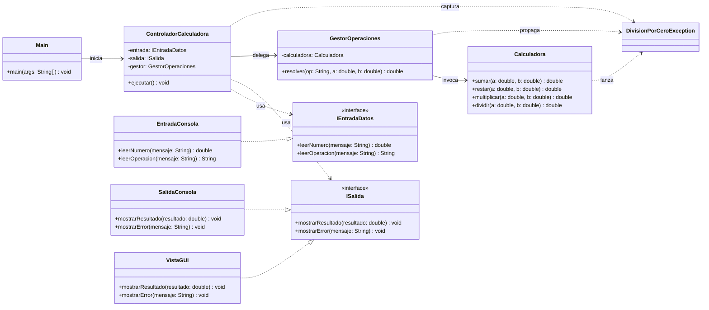
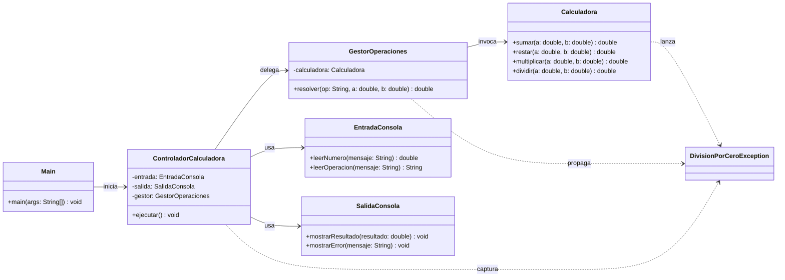
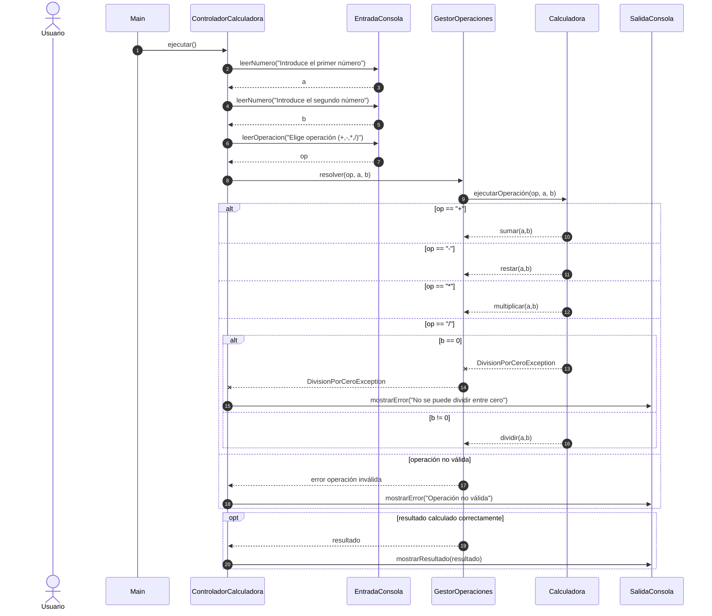

## Diagrama de Clases Calculadora completa

## Diagrama de Clases Calculadora simplificada:

## Diagrama de secuencia Calculadora sencilla

## Diagrama de estados
```mermaid
stateDiagram-v2
[*] --> Inicio

Inicio --> PidiendoNumero1
PidiendoNumero1 --> PidiendoNumero2 : número1 válido
PidiendoNumero1 --> ErrorEntrada : número1 inválido

PidiendoNumero2 --> PidiendoOperacion : número2 válido
PidiendoNumero2 --> ErrorEntrada : número2 inválido

PidiendoOperacion --> ValidandoOperacion
ValidandoOperacion --> Calculando : operación válida
ValidandoOperacion --> ErrorOperacion : operación no válida

Calculando --> MostrandoResultado : cálculo OK
Calculando --> ErrorDivisionCero : división entre cero

MostrandoResultado --> Fin
ErrorEntrada --> Fin
ErrorOperacion --> Fin
ErrorDivisionCero --> Fin

Fin --> [*]
```mermaid
