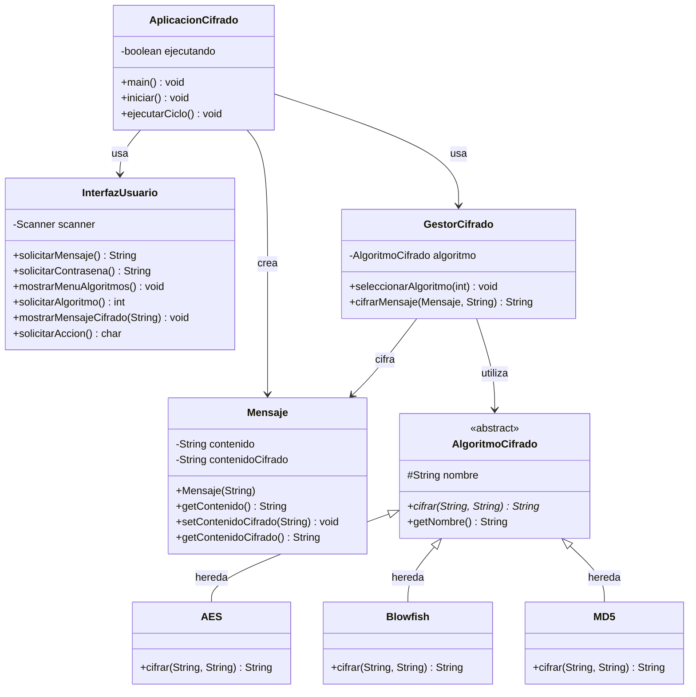
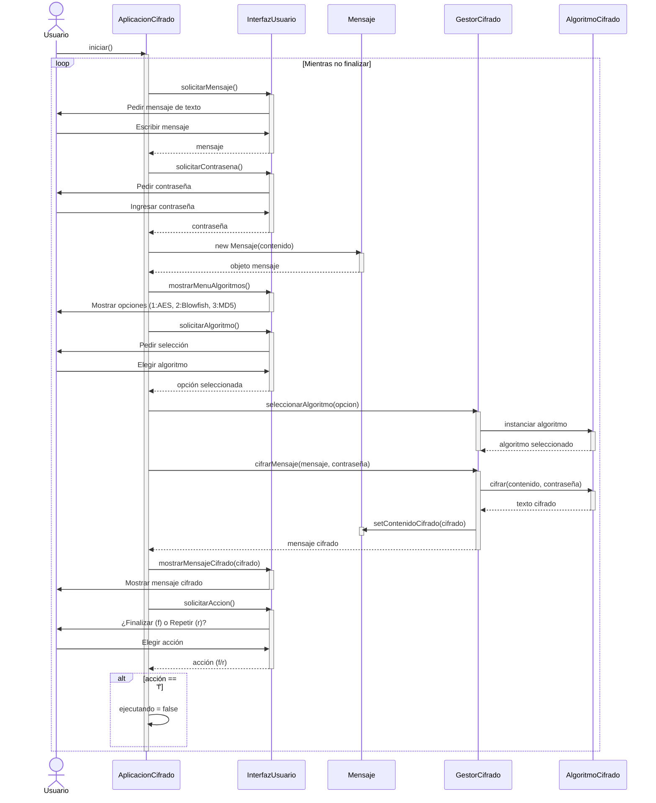

## Ahora vamos a creaer un esquema sin el código


### Prompt:
Crea un diagrama de clases en UML para pegar en GitHub con Mermaid, de una aplicación cuya funcionalidad es la siguiente: el usuario pide al usuario escribr un mensaje de texto, luego el sistema va a pedir una contraseña Después vamos a elegir unos de los algorimos de cifrados, AES, Blowfish o MD3 y el sistema va a mostrar el mensaje cifrado. Para finalizar, el sistema pide al usuario finalizar (f) o repetir cifrado (r)

## Diagrama de clases en mermaid

```java
classDiagram
    class AplicacionCifrado {
        -boolean ejecutando
        +main() void
        +iniciar() void
        +ejecutarCiclo() void
    }

    class InterfazUsuario {
        -Scanner scanner
        +solicitarMensaje() String
        +solicitarContrasena() String
        +mostrarMenuAlgoritmos() void
        +solicitarAlgoritmo() int
        +mostrarMensajeCifrado(String) void
        +solicitarAccion() char
    }

## Diagrama de secuencia

sequenceDiagram
    actor Usuario
    participant App as AplicacionCifrado
    participant UI as InterfazUsuario
    participant Msg as Mensaje
    participant Gestor as GestorCifrado
    participant Algo as AlgoritmoCifrado

    Usuario->>App: iniciar()
    activate App
    
    loop Mientras no finalizar
        App->>UI: solicitarMensaje()
        activate UI
        UI->>Usuario: Pedir mensaje de texto
        Usuario->>UI: Escribir mensaje
        UI-->>App: mensaje
        deactivate UI
        
        App->>UI: solicitarContrasena()
        activate UI
        UI->>Usuario: Pedir contraseña
        Usuario->>UI: Ingresar contraseña
        UI-->>App: contraseña
        deactivate UI
        
        App->>Msg: new Mensaje(contenido)
        activate Msg
        Msg-->>App: objeto mensaje
        deactivate Msg
        
        App->>UI: mostrarMenuAlgoritmos()
        activate UI
        UI->>Usuario: Mostrar opciones (1:AES, 2:Blowfish, 3:MD5)
        deactivate UI
        
        App->>UI: solicitarAlgoritmo()
        activate UI
        UI->>Usuario: Pedir selección
        Usuario->>UI: Elegir algoritmo
        UI-->>App: opción seleccionada
        deactivate UI
        
        App->>Gestor: seleccionarAlgoritmo(opcion)
        activate Gestor
        Gestor->>Algo: instanciar algoritmo
        activate Algo
        Algo-->>Gestor: algoritmo seleccionado
        deactivate Algo
        deactivate Gestor
        
        App->>Gestor: cifrarMensaje(mensaje, contraseña)
        activate Gestor
        Gestor->>Algo: cifrar(contenido, contraseña)
        activate Algo
        Algo-->>Gestor: texto cifrado
        deactivate Algo
        Gestor->>Msg: setContenidoCifrado(cifrado)
        activate Msg
        deactivate Msg
        Gestor-->>App: mensaje cifrado
        deactivate Gestor
        
        App->>UI: mostrarMensajeCifrado(cifrado)
        activate UI
        UI->>Usuario: Mostrar mensaje cifrado
        deactivate UI
        
        App->>UI: solicitarAccion()
        activate UI
        UI->>Usuario: ¿Finalizar (f) o Repetir (r)?
        Usuario->>UI: Elegir acción
        UI-->>App: acción (f/r)
        deactivate UI
        
        alt acción == 'f'
            App->>App: ejecutando = false
        end
    end
    
    deactivate App


    class Mensaje {
        -String contenido
        -String contenidoCifrado
        +Mensaje(String)
        +getContenido() String
        +setContenidoCifrado(String) void
        +getContenidoCifrado() String
    }

    class GestorCifrado {
        -AlgoritmoCifrado algoritmo
        +seleccionarAlgoritmo(int) void
        +cifrarMensaje(Mensaje, String) String
    }

    class AlgoritmoCifrado {
        <<abstract>>
        #String nombre
        +cifrar(String, String)* String
        +getNombre() String
    }

    class AES {
        +cifrar(String, String) String
    }

    class Blowfish {
        +cifrar(String, String) String
    }

    class MD5 {
        +cifrar(String, String) String
    }

    AplicacionCifrado --> InterfazUsuario : usa
    AplicacionCifrado --> GestorCifrado : usa
    AplicacionCifrado --> Mensaje : crea
    GestorCifrado --> AlgoritmoCifrado : utiliza
    GestorCifrado --> Mensaje : cifra
    AlgoritmoCifrado <|-- AES : hereda
    AlgoritmoCifrado <|-- Blowfish : hereda
    AlgoritmoCifrado <|-- MD5 : hereda
```




