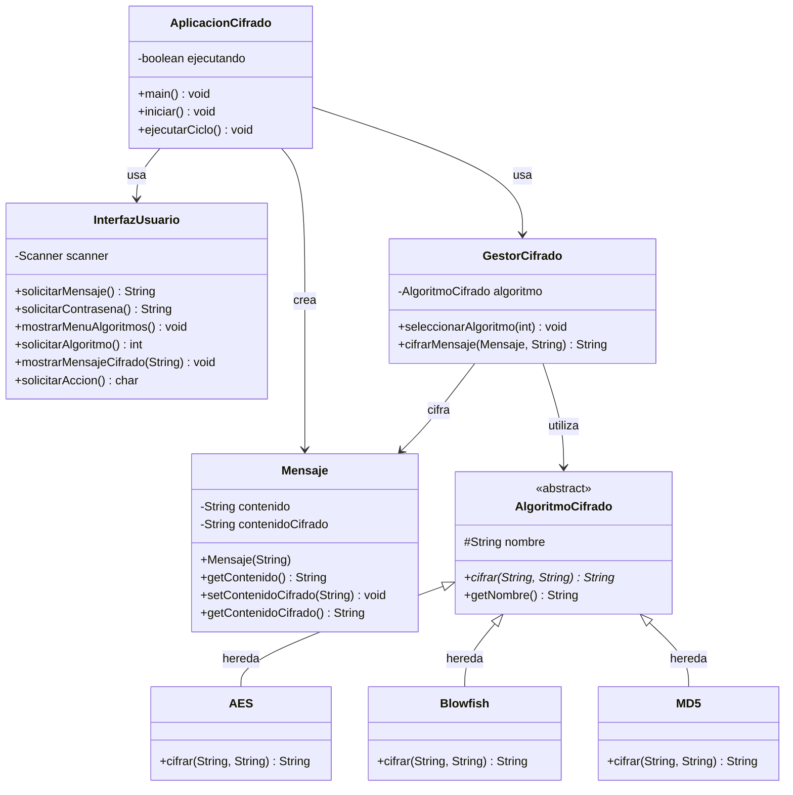

## Ahora vamos a creaer un esquema sin el código


### Prompt:
Crea un diagrama de clases en UML para pegar en GitHub con Mermaid, de una aplicación cuya funcionalidad es la siguiente: el usuario pide al usuario escribr un mensaje de texto, luego el sistema va a pedir una contraseña Después vamos a elegir unos de los algorimos de cifrados, AES, Blowfish o MD3 y el sistema va a mostrar el mensaje cifrado. Para finalizar, el sistema pide al usuario finalizar (f) o repetir cifrado (r)

## Diagrama de clases en mermaid

```java
classDiagram
    class AplicacionCifrado {
        -boolean ejecutando
        +main() void
        +iniciar() void
        +ejecutarCiclo() void
    }

    class InterfazUsuario {
        -Scanner scanner
        +solicitarMensaje() String
        +solicitarContrasena() String
        +mostrarMenuAlgoritmos() void
        +solicitarAlgoritmo() int
        +mostrarMensajeCifrado(String) void
        +solicitarAccion() char
    }

    class Mensaje {
        -String contenido
        -String contenidoCifrado
        +Mensaje(String)
        +getContenido() String
        +setContenidoCifrado(String) void
        +getContenidoCifrado() String
    }

    class GestorCifrado {
        -AlgoritmoCifrado algoritmo
        +seleccionarAlgoritmo(int) void
        +cifrarMensaje(Mensaje, String) String
    }

    class AlgoritmoCifrado {
        <<abstract>>
        #String nombre
        +cifrar(String, String)* String
        +getNombre() String
    }

    class AES {
        +cifrar(String, String) String
    }

    class Blowfish {
        +cifrar(String, String) String
    }

    class MD5 {
        +cifrar(String, String) String
    }

    AplicacionCifrado --> InterfazUsuario : usa
    AplicacionCifrado --> GestorCifrado : usa
    AplicacionCifrado --> Mensaje : crea
    GestorCifrado --> AlgoritmoCifrado : utiliza
    GestorCifrado --> Mensaje : cifra
    AlgoritmoCifrado <|-- AES : hereda
    AlgoritmoCifrado <|-- Blowfish : hereda
    AlgoritmoCifrado <|-- MD5 : hereda
```


