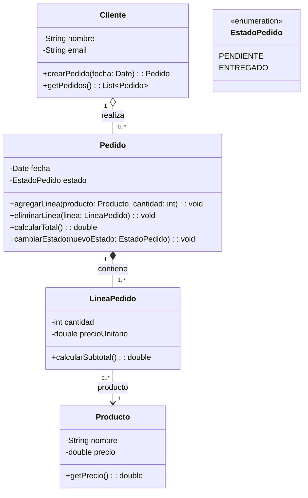

## Diagrama de clases Pedidos y relaciones
Vamos a crear los diagramas con dos prompt diferentes, uno más detallado y otro sencillo y observaremos el resultado.

## Prompt base con indicaciones sobre agregaciones y composición
Quiero diseñar el diagrama de clases UML de un sistema con clases en Java orientado a objetos, antes de programarlo. El sistema será una aplicación sencilla de gestión de pedidos para una tienda, con las siguientes funcionalidades: 

- Un Cliente puede realizar varios pedidos. 
- Cada Pedido tiene una fecha y un estado (pendiente o entregado). 
- Cada Pedido está compuesto por una o varias líneas de pedido. 
- Cada Línea de Pedido indica la cantidad de un Producto concreto. 
- Un Producto tiene nombre y precio. 
- Un Producto puede aparecer en muchas líneas de pedido. 
- Si se elimina un Pedido, sus líneas desaparecen. 
- Si se elimina un Cliente, los pedidos pueden mantenerse como histórico. 
- Requisitos del diagrama: Usa formato Mermaid. 

Incluye: Composición donde el ciclo de vida dependa de otra clase, agregación donde la relación sea más débil, multiplicidades correctas (1, 0.., 1..), marca atributos privados con (-) y métodos públicos con (+), no expliques teoría, solo genera el bloque Mermaid listo para GitHub, no generes código Java. Es para incluirlo como documentación en GitHub. Diseña el sistema con una estructura clara y coherente. 

## Diagrama generado:

## Prompt simplificado sin especificar relaciones de composición ni agregación:
Quiero diseñar el diagrama de clases UML de un sistema con clases en Java orientado a objetos, antes de programarlo. El sistema será una aplicación sencilla de gestión de pedidos para una tienda, con las siguientes funcionalidades: 
Un Cliente puede realizar varios pedidos. 
Cada Pedido tiene una fecha y un estado (pendiente o entregado). 
Cada Pedido está compuesto por una o varias líneas de pedido. 
Cada Línea de Pedido indica la cantidad de un Producto concreto. 
Un Producto tiene nombre y precio. 
Un Producto puede aparecer en muchas líneas de pedido. 
Si se elimina un Pedido, sus líneas desaparecen. 
Si se elimina un Cliente, los pedidos pueden mantenerse como histórico. 
Requisitos del diagrama: Usa formato Mermaid. 
Es para incluirlo como documentación en GitHub. Diseña el sistema con una estructura clara y coherente. 

## Diagrama creado:

